## 🤖 Agentic AI Assistant

This project is an LLM-powered Agentic AI system that can autonomously use multiple tools to perform tasks such as data analysis, visualization, retrieval-augmented question answering (RAG), and external data fetching.

The system uses a LangChain agent with MCP (Model Context Protocol) to orchestrate distributed tool servers, generate executable code when needed, store outputs in a shared workspace, and maintain conversational context through a backend database.

## 🎥 Demo & Screenshots

Chatbot screen:


## Capabilities

## 🧠 Architecture Diagram

```mermaid
flowchart TD

    A[User - Streamlit UI] --> B[FastAPI Backend]

    B --> C[Session Creation + Shared Folder]
    C --> D[Chat History + Intent Detection]

    %% -------- AGENT ORCHESTRATION --------

    D --> E[LangChain Agent - LLM Powered]

    E --> F[MCP Client]

    F --> G1[Data & Intelligence Server 
    Own Backend LLM]
    F --> G2[External Services Server 
    Own Backend LLM]

    %% -------- TOOLS --------

    G1 --> T1[data_analysis Tool]
    G1 --> T2[data_visualization Tool]
    G1 --> T3[RAG Tool]

    G2 --> T4[fetch_environmental_data Tool]
    G2 --> T5[find_nearby Tool]

    %% -------- TOOL INTERNALS --------

    T1 --> D1[Read CSV → Generate Python Analysis Code → Execute via Python REPL → Produce Insights]

    T2 --> D2[Read CSV → Generate Plot Code using plotly express → Execute via Python REPL → Create Plotly Charts → Save as JSON]

    T3 --> D3[ChromaDB Retrieval → Embedding Model → Top-K Search → Cross-Encoder Reranking → LLM Answer]

    T4 --> D4[Extract City → Nominatim Geocoding → Open-Meteo API → Create DataFrame → Save CSV]

    T5 --> D5[Geocode Location → Overpass API Query → Parse Nearby Places → Return Results]

    %% -------- MERGE --------

    D1 --> S[Save Results to Shared Folder]
    D2 --> S
    D3 --> S
    D4 --> S
    D5 --> S

    %% -------- RESPONSE PIPELINE --------

    S --> H[Format Response + Attach Filepaths]
    H --> I[Update Chat Database]
    I --> J[Return Response to UI]

```


---

# 🚀 Tool Execution Flow


---

# 📂 Shared Workspace Concept

Each chat automatically gets its own working directory:

```
static/
   user_id/
      session_id/
         chat_id/
            files generated by tools
```

This enables:

* Persistent artifacts
* Tool collaboration
* File downloads in UI
* Reproducibility of results

---
## Capabilities
# ⭐ Why This Architecture Stands Out

* Distributed AI system with multiple servers
* Agent reasoning + tool orchestration
* Artifact aware workflows
* Stateful sessions
* Modular and scalable design
* Production ready backend separation

```
Frontend → API → Agent → MCP → Tools → Files → User
```

## Installation in local


