# 🤖 Agentic AI Assistant

This project is an LLM-powered Agentic AI system that can autonomously use multiple tools to perform tasks such as data analysis, visualization, retrieval-augmented question answering (RAG), and external data fetching. 
The system uses a LangChain agent with MCP (Model Context Protocol) to orchestrate distributed tool servers, generate executable code when needed, store outputs in a shared workspace, and maintain conversational context through a backend database.

---

## ✨ Highlights

* 🧠 LLM Agentic reasoning with autonomous tool selection
* 🔌 Multi-server architecture using **Model Context Protocol (MCP)**
* 📊 Automatic data analysis & Plotly visualization via generated Python coding tool
* 🔎 Retrieval-Augmented Generation (RAG) with reranking
* 🌍 External API integration (geospatial + environmental data)
* ⚡ Modular and scalable design for adding new tools
* 📁 Shared artifact workspace with session isolation

---

## 🎥 Demo

### Chatbot Interface


### Working 📽️ 


[Watch the full bot working demo](https://drive.google.com/file/d/1wOrEEeWwlTcA-M79QzTeBHMGIez6mx9I/view?usp=sharing)

---

## 🧩 Core Capabilities

The agent dynamically coordinates multiple tools to complete tasks end-to-end:

* Fetch environmental data for any city and duration from openmeteo.
* Perform automated analysis on generated datasets
* Create interactive visualizations (Plotly JSON artifacts)
* Query domain knowledge using RAG pipelines
* Retrieve nearby location information using geospatial APIs
* Persist results for download and reuse

The architecture is intentionally designed to support **plug-and-play tool servers**.

---

## 🧠 Architecture Diagram

```mermaid
flowchart TD

    A[User - Streamlit UI] --> B[FastAPI Backend]

    B --> C[Session Creation + Shared Folder]
    C --> D[Chat History + Intent Detection]

    %% -------- AGENT ORCHESTRATION --------

    D --> E[LangChain Agent - LLM Powered]

    E --> F[MCP Client]

    F --> G1[Data & Intelligence Server 
    Own Backend LLM]
    F --> G2[External Services Server 
    Own Backend LLM]

    %% -------- TOOLS --------

    G1 --> T1[data_analysis Tool]
    G1 --> T2[data_visualization Tool]
    G1 --> T3[RAG Tool]

    G2 --> T4[fetch_environmental_data Tool]
    G2 --> T5[find_nearby Tool]

    %% -------- TOOL INTERNALS --------

    T1 --> D1[Read CSV → Generate Python Analysis Code → Execute via Python REPL → Produce Insights]

    T2 --> D2[Read CSV → Generate Plot Code using plotly express → Execute via Python REPL → Create Plotly Charts → Save as JSON]

    T3 --> D3[ChromaDB Retrieval → Embedding Model → Top-K Search → Cross-Encoder Reranking → LLM Answer]

    T4 --> D4[Extract City → Nominatim Geocoding → Open-Meteo API → Create DataFrame → Save CSV]

    T5 --> D5[Geocode Location → Overpass API Query → Parse Nearby Places → Return Results]

    %% -------- MERGE --------

    D1 --> S[Save Results to Shared Folder]
    D2 --> S
    D3 --> S
    D4 --> S
    D5 --> S

    %% -------- RESPONSE PIPELINE --------

    S --> H[Format Response + Attach Filepaths]
    H --> I[Update Chat Database]
    I --> J[Return Response to UI]

```



---

## 🚀 Tool Execution Flow


---

## 📂 Shared Workspace Design

Each conversation automatically gets its own artifact directory:

```
static/
   user_id/
      session_id/
         chat_id/
            generated files
```

This enables:

* Persistent artifacts
* Tool collaboration
* Session reproducibility
* File downloads from UI
* Isolation between users

---

## 🛠️ Tech Stack

**Frontend**

* Streamlit

**Backend**

* FastAPI
* Python

**Agent Framework**

* LangChain
* Model Context Protocol (MCP)

**LLMs**

* Google / Azure OpenAI (pluggable)

**Data & Visualization**

* Pandas
* Plotly

**Retrieval**

* ChromaDB
* Sentence Transformers
* Cross-Encoder reranking

**External Services**

* Open-Meteo API
* Nominatim
* Overpass API

---

## ⭐ Why This Project Matters

This project demonstrates real-world agent engineering concepts:

* Distributed AI systems
* Tool orchestration patterns
* Artifact-aware workflows
* Stateful conversational infrastructure
* Scalable multi-server AI architecture

Pipeline overview:

```
Frontend → API → Agent → MCP → Tools → Files → User
```

---

## ⚙️ Minimal Local Setup

```bash
pip install -r requirements.txt

python data_and_intelligence_server.py
python external_services_server.py
python fastapi_app.py

streamlit run streamlit_app.py --server.port 8700
```

---

## 📌 Future Extensions

* Docker & Kubernetes deployment
* Streaming tool execution
* Multi-agent collaboration planning
* Tool marketplace integration
* Observability & tracing

---

## 👩‍💻 Author

**Soundarya Sarathi**
AI / Backend Engineer • Agentic AI Systems


